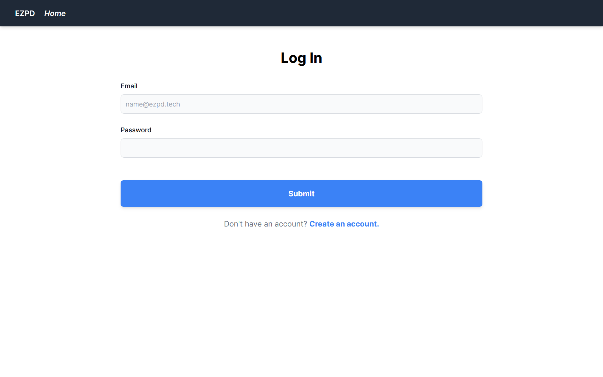

<h1>
Welcome to EZPD! <a href="https://rahulmahesh.me/"></h1></a>

<h2> Parkinson's Disease</h2>

With millions affected by Parkinson's each year, affordable and accessible treatment is a necessity. Currently, diagnosis of PD is often late and inaccurate, as doctors must carefully weigh symptoms, family history, and other factors to come to a conclusion, which leads to reduced treatment options, high morbidity rates, and a lower quality of life. As a result, there are no tests that can give a conclusive result. Therefore, we created EZPD, an accessible and easy-to-use integrated platform using machine learning and computer vision that allows for free early diagnosis of Parkinson’s through a multi-step test: handwriting analysis, which analyzes a spiral drawing, speech recognition, and human gait analysis. 

   

